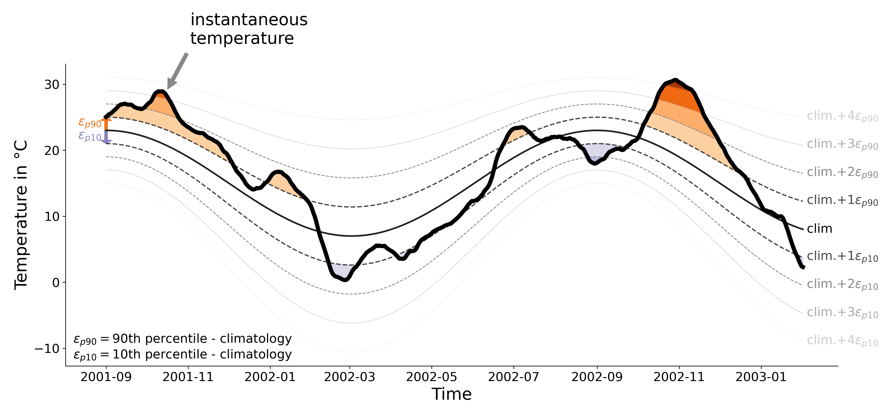

**Marine heatwaves (MHWs)** are defined as discrete periods of exceptionally high water temperatures (Fig. 1). Such anomalously warm periods can have profound consequences for marine organisms and ecosystems.
As the intensity and frequency of MHWs has increased over the last decades, and is projected to do so further in the future, they pose an increasing threat to marine life. MHWs are commonly detected at the sea surface, guided by the availability of satellite based measurements of sea surface temepratures (SST). Yet, the habitats of many marine organisms span the upper ocean water column, suggesting that temperature extremes beneath the well-mixed surface ocean (i.e., the mixed layer) are of similar relevance for marine life. To date, research on such subsurface MHWs is limited. 

In my research, I try to overcome this knowledge gap and extend the view on MHWs beyond the sea surface. In order to do so, I rely on data from high resolution regional ocean model simulations, which reproduces the upper ocean state as realistically as possible.

*Figure 1: Sketch of MHW definition following Hobday et al. (2016, 2018).*

++++++++ page under construction ++++++++

*Figure 1: Sketch of MHW definition following Hobday et al. (2016, 2018).*
